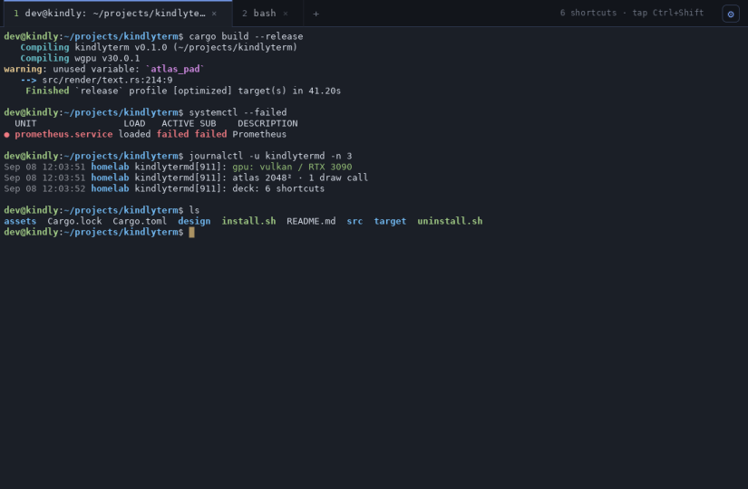
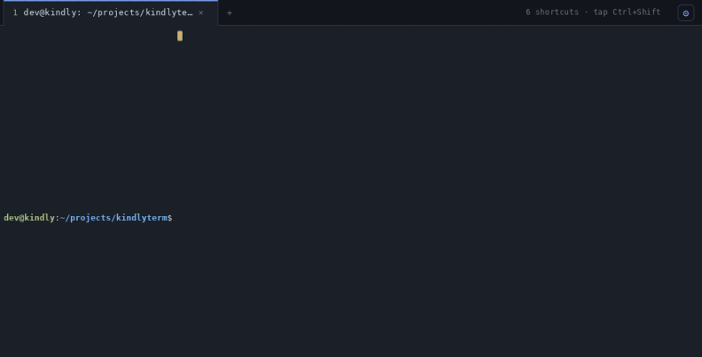
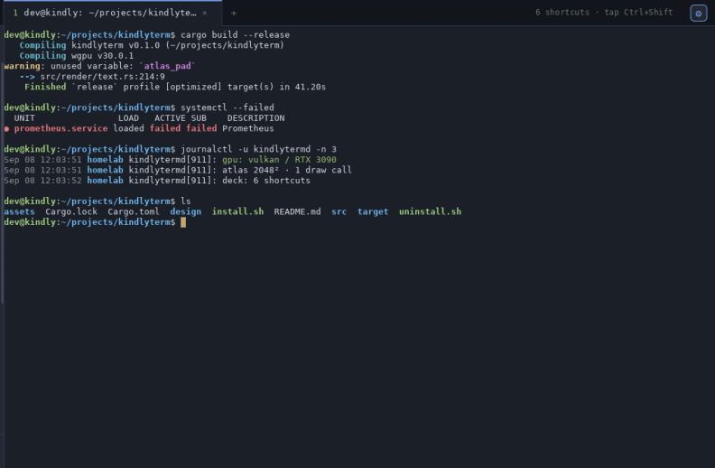

# kindlyTerm

A GPU-accelerated terminal for Linux with spatial awareness. Any tab can
become an infinite, zoomable canvas where shells are cards you arrange,
group, pin and see all at once, or stay a plain terminal tab. Add a
keyboard-driven Control Deck of saved commands, shells that survive a
restart, and an MCP control API so an agent can use the same canvas you
do.



> **A note on how it was made.** kindlyTerm was designed, written and
> reviewed by one person working with AI coding tools. It is used daily,
> but it has not had a second pair of human eyes. Read the security notes
> before pointing it at anything that matters, and please report what you
> find.

## What it does

**Tabs and the Canvas.** A tab opens as one shell filling the window, as
in any terminal. Add a second terminal to it and the tab becomes a
canvas: a zoomable board where each shell is a card. Move and resize
cards, snap them together, gather them into named groups, pin one to the
screen while you pan around, mirror one for a second view, drop images
next to them. Zoom far out and dozens of shells become a map of activity.
Tabs and canvases mix freely, and a canvas with one card left can go back
to being a plain tab.

**Shells that survive a restart.** Each shell runs in its own detached
host. Quit or crash the app, and the next start reattaches to every shell
with its scrollback, colours and whatever full-screen program was up.

**A good terminal.** Crisp text at every zoom, tabs that tear off and
merge, a Control Deck for saved commands and settings that works entirely
from the keyboard, an animated cursor, a typing trail and paste rain if
you like effects, and careful handling of the clipboard, pastes and links.

**Open to agents.** Turn on the control API and any MCP client gets a tool
for everything you can do on the canvas: create terminals with a command,
read screens and scrollback, type, arrange, group, pin, watch a job for
silence, take a screenshot. An agent can spawn a terminal per worker, put
them in a group named after the job, read the results back and close what
is done, while you click into any worker and type. Every action is
announced and animated so you always see what it did.

## Prerequisites

- Linux with Wayland or X11, and a GPU driver with Vulkan (what `wgpu`
  renders through). Any desktop works; the installer adds a launcher entry
  and icon that GNOME, KDE and others pick up.
- Rust 1.88 or newer (`rustup update stable`).
- `fontconfig` and a monospace font.
- Optional: an [MCP](https://modelcontextprotocol.io) client such as
  Claude Code, Codex or Cursor to drive it, `python3` for the demo,
  `ffmpeg` to record it.

## Install

```sh
cargo run --release        # try it without installing
./install.sh               # ~/.local/bin/kindlyterm plus a launcher and icon
./install.sh --system      # /usr/local instead (sudo)
./install.sh --uninstall
```

The first run writes `~/.config/kindlyterm/config.toml` with defaults.
Launching kindlyTerm again while it is running opens a new window in the
same instance, with the shell started in the launching directory.

To let an agent drive it, turn on *About → Let tools drive kindlyTerm* in
the Deck (`Ctrl+Shift+,`), then register `kindlyterm --mcp` as a stdio MCP
server in your client. With Claude Code that is one command:

```sh
claude mcp add kindlyterm -- kindlyterm --mcp
```

## The Canvas

Every tab is a canvas. A fresh tab shows one terminal filling the window.
Press `Ctrl+Shift+Enter` (or right-click → *Turn into canvas*) and it
becomes a free layout where each terminal is a movable, resizable card
with its own title bar. Tabs holding a free canvas show `▦` in the tab bar.

- **Add** terminals with `Ctrl+Shift+Enter`, right-click → *New terminal
  here*, or by launching a saved command from the Deck.
- **Move** by dragging a title bar; **resize** by dragging any edge. Cards
  snap to each other, and resizing steps in whole cells.
- **Pan** with the wheel, a middle-button drag, or a left-drag on empty
  space; hold `Space` to pan while over a terminal. `Ctrl`+wheel **zooms**
  about the pointer, and text stays crisp at every zoom.
- **Focus** a card by clicking it or with `Ctrl+Tab`. `Ctrl+Shift+F` zooms
  it to fill the window and back; `Ctrl+Shift+A` fits everything into view.
- **Select several** with `Shift`+click or `Shift`+drag on empty canvas.
  Dragging one selected card moves them all.
- **Groups** (`Ctrl+Shift+G`, or *New group with this* on a card's menu)
  gather the selection into a tidy grid inside a named, tinted frame,
  moved into free space so no outsider is caught in it. Drag the label to
  move the whole group, double-click it to rename, resize the frame to
  change who belongs. **Drag a card onto a group** and the frame lights up;
  release and the group re-tidies around it. The label's menu has zoom,
  rename, *Arrange members*, ungroup and close all.
- **Pin** a card (`Ctrl+Shift+P`) and it floats in screen space above the
  canvas, unmoved by pan and zoom: a build log can stay in the corner
  while you work elsewhere.
- **Watch for quiet**: a card's menu → *Tell me when it goes quiet*. After
  30 seconds without output its frame blinks and the tab bar says so.
- **Mirror** a card for a second live view of the same shell; both can
  type. **Images** (PNG, JPEG, WebP, BMP, GIF) drop or paste onto the
  canvas and move, resize, group and pin like terminals.
- Zoomed far out, cards draw as compact bars with a cursor dot, so a
  board with dozens of shells stays cheap and you can still see activity.

The layout is saved to `~/.config/kindlyterm/state.json` and restored on
the next start, together with the shells themselves.

## Driving it from an AI agent (MCP)

kindlyTerm speaks the [Model Context Protocol](https://modelcontextprotocol.io),
so any agent that can use MCP tools can drive it. With the toggle on and
the server registered, the agent gets one tool per thing you can do on
the canvas:

| | Tools |
|---|---|
| Look | `list_canvases` `list_terminals` `read_screen` `read_scrollback` `get_activity` `list_sessions` `screenshot` |
| Type | `send_text` `send_key` (optional `typing` speed and key `count`) |
| Terminals | `create_terminal` (command, cwd, name, position) `close_terminal` `focus` `rename_item` `mirror_terminal` `set_monitor` |
| Arrange | `move_item` `resize_item` `pin_item` `place_image` `remove_item` |
| Groups | `create_group` `add_to_group` `arrange_group` `rename_group` `delete_group` |
| View | `zoom_to` `set_viewport` `set_window` `create_canvas` `rename_canvas` `delete_canvas` |

Everything an agent does is visible. Typing lights the card up, short text
replays the typing trail and longer text falls in as paste rain; closes,
moves and groupings are announced in the tab bar. The bytes reach the
shell before the show starts, so the agent is never slowed down by it.
Multi-line text arrives as one bracketed paste, so a shell shows the
block and waits for Enter instead of running each line as it lands.

The worker pattern in tool terms: `create_terminal` per worker, then
`create_group` named after the job, `get_activity` and `set_monitor` to
watch them, `read_screen` to collect results, `close_terminal` for the
ones that are done.

**Demo.** `python3 demo/showtime.py` (or the `/showtime` skill in this
repo) plays a scripted tour on the running window: typing, paste
rain, real work cards with a silence monitor, a pan and zoom, then an
agent that narrates in a pinned log, spawns workers, reads them, lines
them up, groups and renames them, and closes the finished ones. `--fast`
shortens the pauses, `--cleanup` closes the tab after.

**How it works.** The app serves a small JSON API on a private Unix socket
(`$XDG_RUNTIME_DIR/kindlyterm/control.sock`, mode 0600). `kindlyterm --mcp`
is a stdio bridge the MCP client spawns; it forwards each tool call to
that socket. Nothing listens on the network, and turning the toggle off removes
the socket at once.



## Shells that survive a restart

Every shell runs in its own small host process, detached from the window.
Quit kindlyTerm or crash it: the shells keep running, and the next start
attaches to them again with scrollback, colours, cursor and whatever
full-screen program was up. Closing a tab or a card ends its shell; only
quitting leaves shells running. A shell no saved layout claims comes back
on a tab called *Recovered*. `kindlyterm --sessions` lists the hosts
(`--prune` removes dead ones). Turn it off with
`terminal.persistent_sessions = false` to run shells in-process.

## Control Deck

Tap `Ctrl+Shift` (press both, let go), `Ctrl+Shift+,`, or click ⚙ in the
tab bar to slide in the Deck: shortcut launcher and settings in one
sidebar, fully keyboard-driven.

- **Home** shows your shortcuts as tiles; **type to filter** (exact, prefix,
  initials, subsequence). `Enter` runs the top match, `Alt+Enter` in a
  new tab, `Shift+Enter` in this one.
- **Theme**, **Font & Size**, **Effects**, Padding, Cursor, Shell,
  Scrollback, Tabs, Keyboard, Clipboard, Import/Export, About.
- **Shortcut editor** (`Ctrl+Shift+S`): glyph and colour, name, command,
  working directory, run-in, keep-open, confirm-first and a global hotkey.

Everything the Deck changes is written to `config.toml`, `commands.toml`
or `state.toml`, and edits to those files apply live.



## Keys and mouse

`Ctrl+/` shows the full cheat sheet in the app. The ones to know:

| Keys | Action |
|---|---|
| `Ctrl+Shift+T` / `W` / `N` / `Q` | New tab / close tab (or the focused card) / new window / quit |
| `Ctrl+Shift+Enter` | Add a terminal beside this one (a plain tab becomes a canvas) |
| `Ctrl+Shift+K` | New empty canvas tab |
| `Ctrl+Shift+F` / `A` / `G` / `P` | Focus mode / fit all / group selection / pin |
| `Ctrl+Shift+=` `-` `0` | Canvas zoom in / out / reset (font size on a plain tab) |
| `Ctrl+Tab`, `Alt+Left`/`Right`, `Alt+1`…`9` | Next tab, previous / next tab, jump to tab N |
| `Ctrl+Shift+O` | Tab switcher |
| `Shift+PageUp/Down`, `Shift+Home/End` | Scroll history |
| `Ctrl`+hover / click | Underline / open a link (URLs and OSC 8; the target shows in the status line) |
| `Ctrl+Shift+C` / `V` | Copy / paste. `Ctrl+C` copies when text is selected, `Ctrl+V` pastes at a prompt |

Tabs: drag to reorder, drag out of the bar to tear off into a window, drop
on another kindlyTerm window to merge, double-click to rename, middle-click
to close. Closing a tab that holds several terminals asks first.
Terminal: drag to select (past the edge to keep selecting through
history), double-click a word, triple-click a line, middle-click pastes the
primary selection. Right-click anywhere for the relevant menu; menus work
from the keyboard too.

## Cursor and effects

The cursor glides between cells, ripples when the window gains focus, and
breathes at rest (`cursor_animation = "breathe" | "blink" | "none"`). Hold
Backspace or Delete for a second and a half and it becomes a laser cutter
facing the text it is cutting (`chomp = "laser" | "none"`).

Two optional effects live in `effects.toml` and the Deck's Effects page:
the **typing trail** (a neon afterglow that scales with typing speed) and
**paste rain** (every pasted character drops into the exact cell where it
landed, exact even for wrapped and scrolling pastes). Presets `off`,
`subtle`, `cyberpunk` (default) and `matrix`; copy the file to share a look.

## Copy and paste

Select with the mouse and it is already copied; `Ctrl+V` at a prompt or
middle-click pastes. Tunable in `[clipboard]`: `copy_on_select`,
`ctrl_c_copies_selection`, `ctrl_v_pastes_in_shell`,
`trim_trailing_newline`, `confirm_multiline_paste`. Bracketed paste is
used when the program supports it. On GNOME Wayland the clipboard goes
through the X11 bridge, so copied text is not handed to a clipboard
manager after kindlyTerm exits.

## Configuration

`~/.config/kindlyterm/config.toml`, watched and applied live:

```toml
[font]
family = "monospace"           # or e.g. "JetBrains Mono"
size = 13.0

[terminal]
scrollback = 10000
shell = "/bin/zsh"             # optional; defaults to $SHELL
cursor = "block"               # block | beam | underline
cursor_animation = "breathe"   # breathe | blink | none
chomp = "laser"                # laser | none
osc52 = "copy"                 # copy | none | both: what programs may do with the clipboard
persistent_sessions = true     # shells survive a restart

[colors]
opacity = 1.0                  # 0.3..1.0 window translucency
# ... see the generated file for every key
```

Saved commands live in `commands.toml` and are editable by hand:

```toml
[[commands]]
name = "homelab"
command = "ssh dev@192.168.1.10"
icon = "⌂"                # badge glyph
color = 4                 # ANSI index 0..15
hotkey = "Alt+H"          # global launcher
keep_open = true          # drop into a shell when the command exits
cwd = "~/Projects"
confirm = true            # ask before running
run_in = "here"           # type it into the current tab; default is a new tab
```

Commands run through your login shell, so aliases and `PATH` apply.

## Security notes

- **Clipboard (OSC 52)**: programs may set the clipboard (you get a notice)
  but not read it, unless `terminal.osc52 = "both"`.
- **Paste**: control characters and the bracketed-paste end marker are
  stripped, and a multi-line paste into a program without bracketed paste
  asks first.
- **Links**: only http, https, ftp and file targets open, never through a
  shell. The real target is shown while you Ctrl-hover; `file:` links open
  only from the right-click menu, where it is visible.
- **Sockets**: hosts and the control API use Unix sockets in a private
  directory that is verified to be owned by you (mode 0700, sockets 0600).
  Nothing listens on the network.
- **Boundary**: any process running as your user can attach to a session
  host and read or type into that shell, the same boundary tmux has. The
  MCP toggle governs the window, not the shells. On a shared machine set
  `persistent_sessions = false` if that matters. While the API is on, any
  program running as you can drive the window, which is the point and the
  risk.
- **Images** are decoded with size limits; dropped file names are
  sanitised before being typed.
- **Hotkeys** cannot take Ctrl+C, Ctrl+D or Ctrl+Z from the shell.
- Developer hooks are inert unless `KINDLYTERM_DEBUG=1` is set.

## Developing

Written in Rust on `alacritty_terminal` (VT parsing, grid, scrollback),
`wgpu` (rendering), `winit` (Wayland/X11) and `swash` (glyphs).

```
src/app/         windows, tabs, input, drawing, canvas interaction, groups, pins,
                 images, links, the control API, developer hooks
src/canvas.rs    canvas model: viewport maths, items, groups, free-space packing
src/host.rs      the detached PTY host; src/session.rs its wire protocol
src/control.rs   control socket; src/mcp.rs the --mcp stdio bridge
src/terminal.rs  one terminal: alacritty Term + local PTY or a host client
src/renderer.rs  wgpu pipeline and src/shader.wgsl
src/deck/        the Control Deck; src/effects.rs trail and rain
demo/showtime.py the scripted tour; .claude/skills/showtime runs it
```

`cargo test` runs the unit tests. With `KINDLYTERM_DEBUG=1`:
`KINDLYTERM_SCREENSHOT=out.png` renders a frame offscreen,
`KINDLYTERM_INPUT='ls\r'` types at startup, `KINDLYTERM_KEYS=…` scripts
actions, `KINDLYTERM_EXIT_AFTER=3000` quits, and
`KINDLYTERM_SESSION_DIR=/run/user/1000/kt-test` keeps test sessions apart
from real ones. `RUST_LOG=kindlyterm=debug` for verbose logs.

Not yet done: mouse clicks reported to applications (the wheel is), bell,
search in scrollback.

## License

MIT. See [LICENSE](LICENSE). Built on
[alacritty_terminal](https://github.com/alacritty/alacritty) (Apache-2.0),
[wgpu](https://github.com/gfx-rs/wgpu), [winit](https://github.com/rust-windowing/winit),
[swash](https://github.com/dfrg/swash), [fontdb](https://github.com/RazrFalcon/fontdb)
and [nucleo](https://github.com/helix-editor/nucleo) (MPL-2.0).
