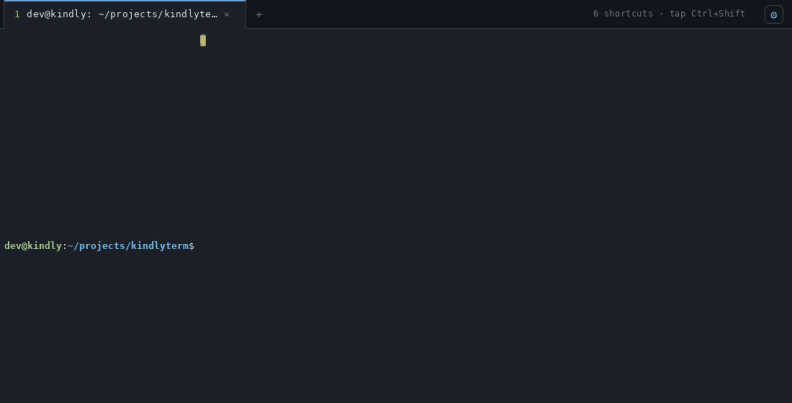
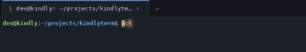
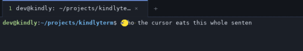
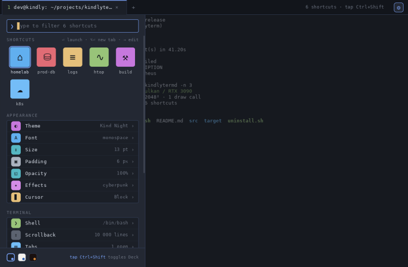
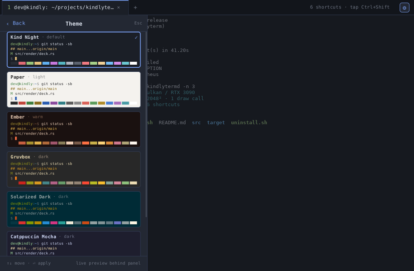
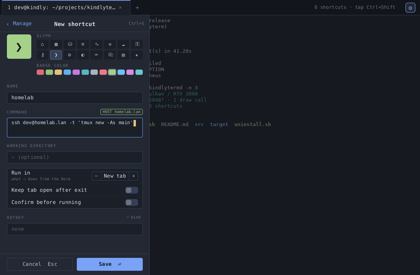
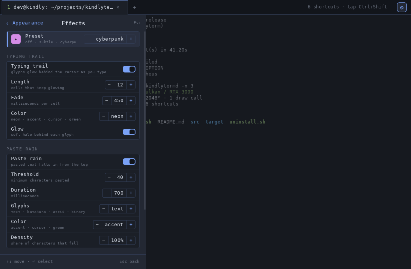
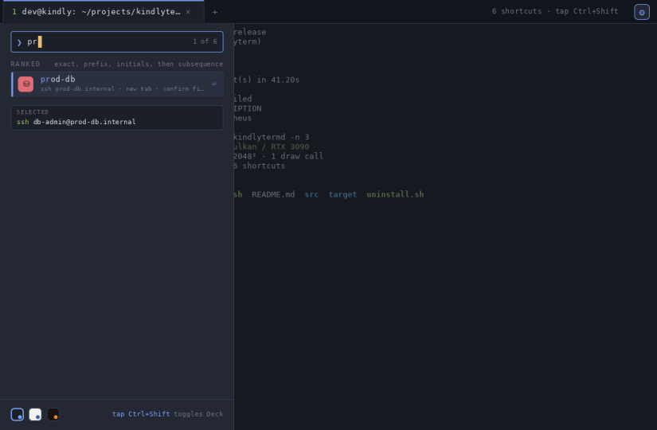
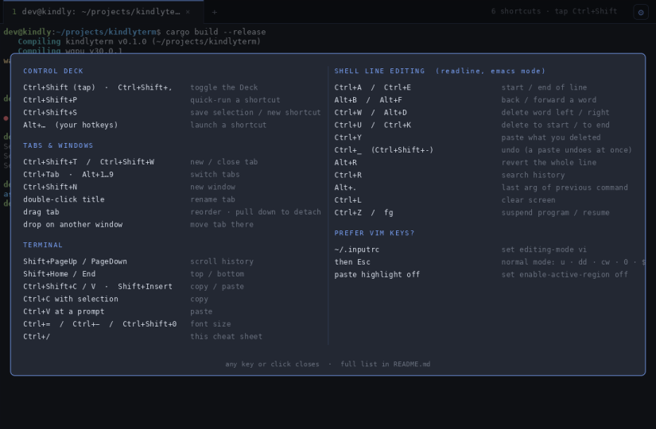

# kindlyTerm

A GPU-accelerated, keyboard-driven terminal for Linux with tabs and a
palette of saved commands.


## In motion

**Paste rain.** Paste a block of text and every character drops from the top
into the exact cell where the shell put it, then the passage assembles:


The same paste with the `matrix` preset (green katakana):



**Typing trail** and the **Pac-Man cursor** (hold Backspace):





**The Control Deck** sliding in, then quick-running a shortcut by typing:


## Screens

| Deck Home | Themes |
|---|---|
|  |  |

| Shortcut editor | Effects |
|---|---|
|  |  |

| Quick-run | Keyboard cheat sheet (Ctrl+/) |
|---|---|
|  |  |
 Written in Rust from scratch on top of
`alacritty_terminal` (VT parsing, grid, scrollback), `wgpu` (Vulkan rendering),
`winit` (Wayland/X11 windowing), and `swash` (glyph rasterization).

## Build & run

```sh
cargo run --release
```

The first run writes `~/.config/kindlyterm/config.toml` with defaults.

## Install into GNOME

```sh
./install.sh            # user-local: ~/.local/bin, launcher + icon, no sudo
./install.sh --system   # or /usr/local for all users
./install.sh --uninstall
```

After that, press Super and type `term` (or `kind`, `shell`, `ssh`): kindlyTerm
appears in GNOME search with its icon, and can be pinned to the dash. The
launcher has a right-click action to open straight into the Control Deck
(`kindlyterm --deck`). The window sets the Wayland app id `kindlyterm` so GNOME
pairs it with the icon. Files: `assets/kindlyterm.desktop`, `assets/kindlyterm.svg`.

## Control Deck

**Tap `Ctrl+Shift`** (press both, let go) or `Ctrl+Shift+,`, or click the ⚙ at
the right of the tab bar, to slide in the **Control Deck**: a 360 px sidebar that is both the shortcut launcher and the settings
app, in the style of iOS Settings. Everything in it works from the keyboard;
the mouse works too.

- **Home** shows your shortcuts as app-style tiles (a list with A–Z headers,
  pinned and recent sections once you have more than 12), then the settings
  groups: Appearance, Terminal, Input, Shortcuts, About.
- **Type to filter** anywhere on Home. Results are ranked exact name, prefix,
  word initials (`pdp` → prod-db-primary), subsequence, host, command body,
  ties broken by recency. Matched characters are highlighted. `Enter` runs the
  top match, `Alt+Enter` forces a new tab, `Shift+Enter` runs it in the
  current tab. No match offers to run the typed text as a command.
- **Theme** lists Kind Night, Paper, Ember, Gruvbox, Solarized Dark, and
  Catppuccin Mocha with live previews behind the panel as you move; `Enter`
  applies and saves, `Esc` reverts.
- **Font & Size** lists installed monospace fonts (moving previews them live),
  with steppers for size and line spacing.
- **Shortcut editor** (`Ctrl+Shift+S`, or `→` on a shortcut): glyph and badge
  color pickers, name, command (host auto-detected from `ssh user@host`),
  working directory, run-in (new tab or this tab), keep-open, confirm-first,
  and a hotkey field: press `Enter` then the key combo, e.g. `Alt+H`, to bind
  a global launcher for it.
- Other pages: Padding, Cursor shape, Shell, Scrollback, Tabs, Keyboard
  (binding reference), Clipboard toggles, Import/Export, About.

Everything the Deck changes is written straight to `config.toml`,
`commands.toml`, or `state.toml` (run history), so hand edits and the Deck
stay in sync.

## Keybindings

| Keys | Action |
|---|---|
| `Ctrl+/` | Keyboard cheat sheet overlay: kindlyTerm keys and shell line-editing keys. Any key or click closes it. |
| `Ctrl+Shift` tap, or `Ctrl+Shift+,` | Toggle the **Control Deck** (launcher + settings). A tap means pressing both and releasing with no other key; chords like `Ctrl+Shift+T` are unaffected. Turn off with `input.ctrl_shift_tap_opens_deck = false`. |
| `Ctrl+Shift+P` | Open the Deck ready to type: quick-run a shortcut. |
| `Ctrl+Shift+S` | New shortcut in the Deck editor (prefilled with the selection, if any). |
| Your own hotkeys | Any `Alt+…`/`Ctrl+…` combo bound in the shortcut editor launches that shortcut. |
| `Ctrl+Shift+O` | Tab switcher palette. |
| `Ctrl+Shift+T` | New shell tab. |
| `Ctrl+Shift+N` | New window. |
| `Ctrl+Shift+W` | Close current tab (the app exits when the last tab closes). |
| `Ctrl+Tab` / `Ctrl+Shift+Tab` | Next / previous tab. `Ctrl+PageDown` / `Ctrl+PageUp` also work. |
| `Alt+1` … `Alt+8`, `Alt+9` | Jump to tab N, `Alt+9` = last tab. |
| `Shift+PageUp` / `Shift+PageDown` | Scroll history by a page. |
| `Ctrl+Shift+Up` / `Ctrl+Shift+Down` | Scroll history by a line. |
| `Shift+Home` / `Shift+End` | Jump to the top / bottom of history. Mouse wheel scrolls too. |
| `Ctrl+Shift+C` / `Ctrl+Shift+V` | Copy selection / paste. `Ctrl+Insert` / `Shift+Insert` do the same. |
| `Ctrl+C` with text selected | Copies the selection (and clears it). With nothing selected it interrupts as usual. |
| `Ctrl+V` at a shell prompt | Pastes. Inside full-screen apps (vim, htop, tmux) `Ctrl+V` is passed through untouched. |
| `Ctrl+=` / `Ctrl+-` / `Ctrl+Shift+0` | Font size bigger / smaller / reset. |
| `Ctrl+Shift+Q` | Quit. |

Inside a palette: `Up`/`Down` or `Ctrl+J`/`Ctrl+K` move, `Ctrl+U` clears the
input, `Ctrl+W` deletes a word, `Esc` closes.

## Mouse

Tab bar:

- **Left click** a tab to switch to it. Click its **×** to close it, or the **+** at the end for a new shell tab.
- **Double-click a tab's title** to rename it in place. The title is selected, so just type the new name; press `→` or `End` first to keep it and append. `Enter` saves, `Esc` cancels, an empty name goes back to the program's own title. Also in the right-click menu as Rename tab.
- **Drag a tab** left or right to reorder.
- **Drag a tab down** out of the bar and release: it becomes its own window. Release it **over another kindlyTerm window** instead and it joins that window as a tab. Dragging a window's only tab onto another window merges the two windows.
- **Middle click** a tab to close it. **Scroll wheel** over the bar cycles tabs.
- **Right click** for a context menu: new tab, new window, run a shortcut, move the tab left/right, move it to a new window or to any other open window, close it, close the others.

Wayland note: the compositor decides where a torn-off window appears, and the
merge is detected by which window the pointer lands in when you release, so
drag by the tab rather than the title bar.

Terminal area:

- Drag to select. Double-click selects a word, triple-click a line. `Shift`+click extends.
- Selecting also fills the primary selection, so **middle click** pastes it.
- **Right click** for a context menu: copy, paste, new tab, saved commands, save a command, clear scrollback, close tab.

Menus can be driven from the keyboard too: `Up`/`Down` (or `Ctrl+J`/`Ctrl+K`), `Enter`, `Esc`.

## Cursor

The cursor is animated: it glides between cells with a short trail instead of
jumping, a soft ring ripples out from it when you click into the window or the
window regains focus, and at rest it breathes (a slow brightness wave) rather
than hard-blinking. `cursor_animation` in `config.toml` picks `breathe`
(default), classic `blink`, or `none`. Hold Backspace or Delete for about a
second and a half and the cursor turns into a chomping Pac-Man facing the
text it is eating, until you let go.

## Effects

Two optional effects, configured in `~/.config/kindlyterm/effects.toml` and in
the Deck under Appearance → **Effects**:

- **Typing trail**: each typed character leaves a neon afterglow that fades
  over about half a second, capped at the last N cells. Strength scales with
  typing speed, so slow typing shows almost nothing and fast bursts light up.
- **Paste rain**: a paste above a size threshold makes every pasted character
  drop from the top of the screen into the exact cell where it landed, bright
  head and shimmering tail, revealing the real text as each one arrives. It
  works by snapshotting the grid before the paste and diffing afterwards, so
  it is exact for multi-line pastes, wrapped lines, scrolling, and pastes into
  editors. Tails shimmer through the pasted text, katakana, ascii, or binary.

Presets: `off`, `subtle`, `cyberpunk` (default), `matrix`. Every knob (length,
fade, colors, threshold, duration, density) is editable; changes are written
back to `effects.toml` immediately, and the preset name becomes `custom`.
**To share a look, copy `effects.toml`** to another machine (or paste one
you were given) and pick Reload on the Effects page. The file is commented.

## Copy & paste

Out of the box, the easiest path is: **select with the mouse, it's already
copied**; then `Ctrl+V` at a prompt (or `Ctrl+Shift+V` anywhere, or middle
click). A "copied N chars" note appears in the tab bar as confirmation.

Details, all tunable in the `[clipboard]` section of `config.toml`:

| Setting | Default | Effect |
|---|---|---|
| `copy_on_select` | `true` | Mouse selection goes straight to the clipboard. The primary selection (middle click) is always filled either way. |
| `ctrl_c_copies_selection` | `true` | `Ctrl+C` copies when text is selected, otherwise sends the interrupt. |
| `ctrl_v_pastes_in_shell` | `true` | `Ctrl+V` pastes unless the program is full-screen or uses the kitty keyboard protocol. |
| `trim_trailing_newline` | `true` | A single copied line loses its trailing newline, so pasting it does not run it immediately. |

Pasting uses bracketed paste when the program supports it, so multi-line
pastes into bash, zsh, fish, or an editor are safe. Programs that set the
clipboard themselves (tmux, neovim via OSC 52) work too.

Note for GNOME on Wayland: the clipboard is served through the X11 bridge, so
text copied from kindlyTerm stays available while kindlyTerm is running (which is
the normal case), but is not handed to a clipboard manager on exit.

## Saved commands

Stored in `~/.config/kindlyterm/commands.toml`. You can edit it by hand:

```toml
[[commands]]
name = "homelab"
command = "ssh dev@192.168.1.10"
icon = "⌂"                # badge glyph (one character)
color = 4                 # badge color, ANSI index 0..15
hotkey = "Alt+H"          # global launcher

[[commands]]
name = "logs"
command = "journalctl -f"
keep_open = true          # drop into a shell when the command exits
cwd = "~/Projects"        # optional working directory
confirm = true            # ask before running
run_in = "here"           # "here" types it into the current tab; default is a new tab
```

Icon and color are optional; the Deck guesses sensible ones from the
command (ssh → house, databases → cylinder, logs → lines, builds → hammer).

Commands run through your login shell (`$SHELL -lc "..."`), so aliases from
your profile and your `PATH` apply. When the command exits the tab closes,
unless `keep_open = true`.

## Configuration

`~/.config/kindlyterm/config.toml`:

```toml
[font]
family = "monospace"   # or e.g. "JetBrains Mono"
size = 13.0
line_padding = 0.0

[terminal]
scrollback = 10000
shell = "/bin/zsh"     # optional; defaults to $SHELL
shell_args = []        # e.g. ["-l"] for a login shell
padding = 6.0
cursor = "block"       # block | beam | underline
cursor_animation = "breathe"   # breathe | blink | none

[colors]
foreground = "#d8dee9"
background = "#1b1f27"
opacity = 1.0          # 0.3..1.0 window translucency (Deck → Appearance → Opacity)
# ... see the generated file for every key
```

## Security notes

- **Clipboard access by programs (OSC 52)**: programs may *set* the clipboard
  (you get a "a program copied to the clipboard" notice) but may not *read*
  it, so a remote host cannot exfiltrate what you last copied. Change with
  `terminal.osc52 = "copy" | "none" | "both"`.
- **Paste sanitizing**: pasted text is stripped of control characters (except
  tab and newline) and of the bracketed-paste end marker, so a crafted paste
  cannot inject escape sequences or break out of the paste bracket.
- **Multi-line paste confirmation**: when the foreground program does not
  support bracketed paste, so every newline would run a command, a confirm
  dialog asks first (`clipboard.confirm_multiline_paste`).
- **Shortcut hotkeys** cannot take Ctrl+C, Ctrl+D, or Ctrl+Z from the shell.
- **Developer hooks** below are inert unless `KINDLYTERM_DEBUG=1` is set.

## Debug knobs

Set `KINDLYTERM_DEBUG=1` to enable these environment variables while developing:

- `KINDLYTERM_SCREENSHOT=/path/out.png` renders a frame offscreen and saves it
  (`KINDLYTERM_SCREENSHOT_FRAME=n` picks the frame, default 30).
- `KINDLYTERM_INPUT='ls\r'` types into the first tab at startup.
- `KINDLYTERM_KEYS=newtab,scroll:40,deck:home,deck:theme,deck:editor,type:gra|down|enter,menu:tabbar,clipset:text,clipget,clippaste`
  applies actions just before the screenshot frame, or after `KINDLYTERM_ACTIONS_AFTER=ms`.
  If the screenshot has not been taken when `KINDLYTERM_EXIT_AFTER` fires, it is taken at exit.
- `KINDLYTERM_EXIT_AFTER=3000` quits after N milliseconds.
- `RUST_LOG=kindlyterm=debug` for verbose logs.

## Layout

```
src/main.rs         entry point, event loop
src/app/mod.rs      windows, tabs, palette, Deck actions, winit handler
src/app/input.rs    keyboard and mouse
src/app/draw.rs     tab bar, terminal grid, overlays
src/app/windows.rs  window lifecycle, tab tear-off / merge, wake-ups
src/app/debug.rs    developer hooks (KINDLYTERM_DEBUG=1)
src/terminal.rs     one PTY + alacritty Term + I/O thread
src/renderer.rs  wgpu pipeline: instanced quads (rects + glyphs)
src/shader.wgsl  the one shader
src/font.rs      fontdb/swash loading, glyph atlas, fallback fonts
src/keys.rs      key event -> escape sequence encoding
src/deck/mod.rs     the Control Deck: state, focus model, ranking
src/deck/pages.rs   page builders
src/deck/input.rs   Deck keyboard and mouse
src/deck/draw.rs    Deck layout, drawing, UI text helpers
src/theme.rs        resolved theme + the six built-in palettes + icon sheet
src/effects.rs      typing trail and paste rain, plus effects.toml
src/palette.rs      tab switcher palette
src/menu.rs         right-click context menus
src/config.rs    config.toml and commands.toml
```

## Not yet done

- Mouse reporting to applications (vim/htop mouse mode)
- Bell, hyperlink (OSC 8) clicking
- Split panes, search in scrollback, config hot reload
- Deck: shortcut folders, aliases, per-row font previews, ligatures, undo after launch
